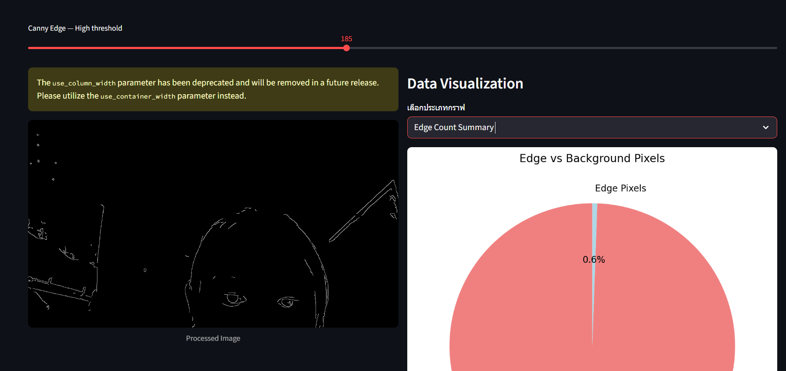

6510110497 นางสาวสิริภัสรา อุปการณ์

# Image Processing Dashboard with Streamlit  

โปรเจ็คนี้เป็น **Web Application** ที่สร้างด้วย [Streamlit](https://streamlit.io/) สำหรับการ **ประมวลผลภาพ (Image Processing)** และ **การวิเคราะห์คุณสมบัติของภาพ** โดยผู้ใช้สามารถเลือกภาพจาก **Webcam** หรือ **URL จากอินเทอร์เน็ต** แล้วทำการปรับแต่ง parameter และดูผลลัพธ์ได้แบบ Real-time  

## Features  
- **Input Source**  
  - เปิดภาพจาก **Webcam**  
  - โหลดภาพจาก **URL**  

- **Image Processing Options**  
  - แปลงเป็น **Grayscale**  
  - ปรับค่า **Gaussian Blur (Kernel Size)**  
  - ตรวจจับเส้นขอบด้วย **Canny Edge Detection** (low/high threshold)  

- **Data Visualization**  
  - **Histogram** ของ intensity values  
  - **Edge Count Summary** (Pie chart: Edge vs Non-Edge)  
  - **Image Statistics** (ค่า Mean, Std, Min, Max, Edge Count)  
  - **Intensity Distribution (Box Plot)**  
  - **Line Plot** ของ intensity profile (แถวกลางของภาพ) 

  ## Demo
    ภาพแสดงการประมวลผลและ Histogram  

